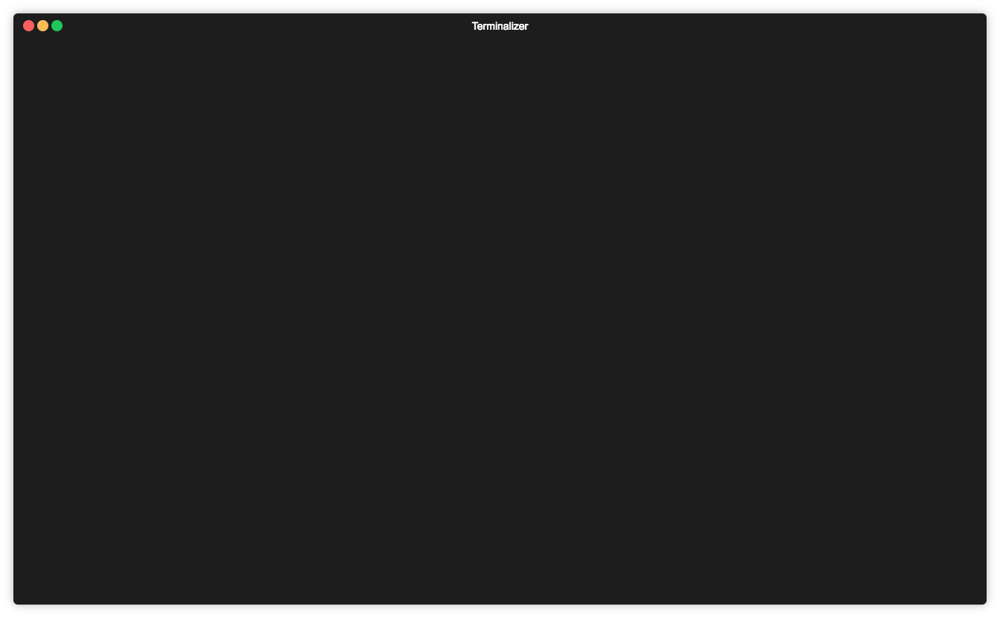

# ASCII Art Generator

### Description
A Go-based script that generates **colorful ASCII art** from images. It processes each 8x8 window of pixels and maps them to the most visually similar character, creating stunning and artistic output.

---

### Demo
Enjoy a demo of the ASCII art generator:


---

### Features
- Converts images to ASCII art with color preservation.
- Efficiently processes images using 8x8 pixel windows for accurate character mapping.
- Utilizes parallel processing for faster conversion, even for larger images.
- Fully automated workflow with an included Bash script.
- Easily customizable to fit your artistic or practical needs.

---

### Setup Instructions
#### **Clone and Initialize the Project**
1. Clone this repository:
   ```bash
   git clone <your_repo_url>
   cd ascii_gen
   ```

2. Initialize the Go module (if not already done):
   ```bash
   go mod init ascii_gen
   ```

3. Install the required package for image resizing:
   ```bash
   go get github.com/nfnt/resize
   ```

#### **Run the Script**
1. Add your images to the `input_images` directory.
2. Run the automated Bash script:
   ```bash
   ./ascii_converter.sh
   ```
   The ASCII art output will be saved to the `ascii_output` directory.

#### **Manual Execution**
Alternatively, you can run the Go program manually:
```bash
go run main.go /path/to/image.jpeg
```
Replace `/path/to/image.jpeg` with the actual path to your image file.

---

### Folder Structure
```
ascii_gen/
├── go.mod             # Go module setup
├── go.sum             # Tracks project dependencies
├── main.go            # Main script to generate ASCII art
├── chars/             # Contains logic for mapping patterns to characters
│   ├── chars.go
├── input_images/      # Place images here for processing
├── ascii_output/      # ASCII art output directory
└── ascii_converter.sh # Bash script for automation
```

---

### Development Notes
- This project was developed primarily as a learning exercise in Go.
- Feel free to explore the `chars/chars.go` file to understand the character mapping logic, followed by the `main.go` file for the overall process.
- Contributions and suggestions are welcome to improve the code, style, or functionality.

---
